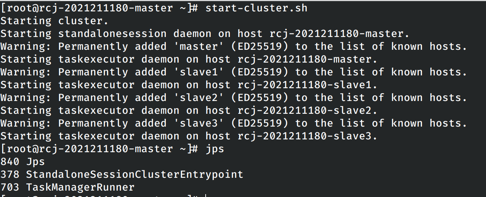
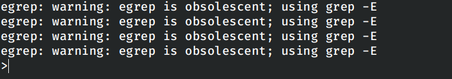

# 大数据实时数据分析综合实践

## 实验目的

### Local模式部署

- 实现`Flink`的安装
- 学会`Flink`的脚本启动
- 使用`Flink`自带的单词统计程序进行测试

### Standalone模式进行部署

实现standalone模式下`Flink`进程的启动。

### Yarn模型进行部署

- 完成`Flink on Yarn`模式的配置
- 在`Yarn`中启动`Flink`集群
- 以文件的形式进行任务提交

### Kafka和Flink

- 安装`Kafka`
- 本地编辑代码读取`Kafka`数据，并且打成jar包
- 将jar包上传到`Flink`集群运行

## 实验过程

### Local模式部署

本次实验只需要在单台机器上启动`Flink`，因此直接在本地计算机上进行实验。

首先确保本地安装了Java 1.8版本的`JDK`：


从`apache`网站上下载`flink`，将其解压到本地之后设置环境变量：

```shell
export FLINK_HOME=$(pwd)
export PATH=$FLINK_HOME/bin:$PATH
```

配置完成之后就启动`flink`服务。


进入`http://localhost:8081`就可以看见`Flink`的管理界面。


在本地模式上运行`Flink`提供的单词计数样例：


在此时的管理界面上也可以看见刚刚提交并完成的任务。


### Standalone模式进行部署

鉴于之前的几次实验都是使用`Docker`容器进行完成，因此这里我们也使用类似的方式进行部署，不过需要注意的是，这里使用的`Dockerfile`文件是实验三版本的，其中并没有包含实验四中涉及的`spark`等的内容，同时为了减少构建出镜像的大小，删除了在`Dockerfile`中配置`hbase`的内容，修改之后的`Dockerfile`之后的内容如下：

```dockerfile
FROM archlinux:latest

# Install necessary dependencies
RUN echo 'Server = https://mirrors.cernet.edu.cn/archlinux/$repo/os/$arch' > /etc/pacman.d/mirrorlist
RUN pacman -Sy --noconfirm openssh jdk8-openjdk which inetutils

# Setting JAVA_HOME env
ENV JAVA_HOME=/usr/lib/jvm/java-8-openjdk

# Configuring SSH login
RUN echo 'ssh-rsa AAAAB3NzaC1yc2EAAAADAQABAAABgQCyyLt1bsAlCcadB2krSCDr0JP8SrF7EsUM+Qiv3m+V10gIBoCBFEh9iwpVN1UMioK8qdl9lm+LK22RW+IU6RjW+zyPB7ui3LlG0bk5H4g9v7uXH/+/ANfiJI2/2+Q4gOQAsRR+7kOpGemeKnFGJMgxnndSCpgYI4Is9ydAFzcQcGgxVB2mTGT6siufJb77tWKxrVzGn60ktdRxfwqct+2Nt88GTGw7eGJfMQADX1fVt9490M3G3x2Kw9KweXr2m+qr1yCRAlt3WyNHoNOXVhrF41/YgwGe0sGJd+kXBAdM2nh2xa0ZZPUGFkAp4MIWBDbycleRCeLUpCHFB0bt2D82BhF9luCeTXtpLyDym1+PS+OLZ3NDcvztBaH8trsgH+RkUc2Bojo1J4W9NoiEWsHGlaziWgF6L3z1vgesDPboxd0ol6EhKVX+QjxA9XE79IT4GidHxDwqonJz/dHXwjilqqmI4TEHndVWhJN0GV47a63+YCK02VAZ2mOA3aw/7LE= ricardo@magicbook-14' >> /root/.ssh/authorized_keys
COPY id_big_data /root/.ssh/id_rsa
RUN echo 'Host *' >> /etc/ssh/ssh_config && echo '    StrictHostKeyChecking no' >> /etc/ssh/ssh_config

# Install Hadoop
ADD hadoop-3.3.6.tar.gz /opt/
RUN mv /opt/hadoop-3.3.6 /opt/hadoop && \
    chmod -R 777 /opt/hadoop

# Configure Hadoop
ENV HADOOP_HOME=/opt/hadoop
RUN echo "slave1" >> $HADOOP_HOME/etc/hadoop/workers
RUN echo "slave2" >> $HADOOP_HOME/etc/hadoop/workers
RUN echo "slave3" >> $HADOOP_HOME/etc/hadoop/workers
RUN mkdir $HADOOP_HOME/tmp
ENV HADOOP_TMP_DIR=$HADOOP_HOME/tmp
RUN mkdir $HADOOP_HOME/namenode
RUN mkdir $HADOOP_HOME/datanode
ENV HADOOP_CONFIG_HOME=$HADOOP_HOME/etc/hadoop
ENV PATH=$JAVA_HOME/bin:$HADOOP_HOME/bin:$HADOOP_HOME/sbin:$PATH
ENV HADOOP_CLASSPATH=$HADOOP_HOME/share/hadoop/tools/lib/*:$HADOOP_HOME/share/hadoop/common/lib/*:$HADOOP_HOME/share/hadoop/common/*:$HADOOP_HOME/share/hadoop/hdfs/*:$HADOOP_HOME/share/hadoop/hdfs/lib/*:$HADOOP_HOME/share/hadoop/yarn/*:$HADOOP_HOME/share/hadoop/yarn/lib/*:$HADOOP_HOME/share/hadoop/mapreduce/*:$HADOOP_HOME/share/hadoop/mapreduce/lib/*:$HADOOP_CLASSPATH
ENV HDFS_NAMENODE_USER="root"
ENV HDFS_DATANODE_USER="root"
ENV HDFS_SECONDARYNAMENODE_USER="root"
ENV YARN_RESOURCEMANAGER_USER="root"
ENV YARN_NODEMANAGER_USER="root"
COPY hadoop_config/* $HADOOP_HOME/etc/hadoop/
RUN sed -i '1i export JAVA_HOME=/usr/lib/jvm/java-8-openjdk' $HADOOP_HOME/etc/hadoop/hadoop-env.sh

# Install zookeeper
ADD apache-zookeeper-3.9.2-bin.tar.gz /opt/
RUN mv /opt/apache-zookeeper-3.9.2-bin /opt/zookeeper && \
    chmod -R 777 /opt/zookeeper

# Configure zookeeper
ENV ZOOKEEPER_HOME=/opt/zookeeper
ENV PATH=$ZOOKEEPER_HOME/bin:$PATH
RUN mkdir $ZOOKEEPER_HOME/tmp
COPY zookeeper_config/* $ZOOKEEPER_HOME/conf/

# Install flink
ADD flink-1.13.6-bin-scala_2.11.tgz /opt/
RUN mv /opt/flink-1.13.6 /opt/flink && \
    chmod -R 777 /opt/flink

# Add hadoop library
ADD commons-cli-1.4.jar /opt/flink/lib/
ADD flink-shaded-hadoop-3-uber-3.1.1.7.2.1.0-327-9.0.jar /opt/flink/lib/

# Configure flink
ENV FLINK_HOME=/opt/flink
ENV PATH=$FLINK_HOME/bin:$PATH
COPY flink_conf/* $FLINK_HOME/conf/

COPY run.sh /run.sh
CMD [ "/run.sh" ]
```

其中`flink`的各个配置文件按照操作手册中的内容进行设置。

在`master`节点上使用和`locak`模型一致的命令启动`flink`集群，使用`jps`查看当前启动的进程：



进入从节点中查看在从节点上启动的进程：


进入Web管理界面：


能看见启动的4个节点和对应的4个`slot`。

再次进行`master`容器中，启动自带的测试用例单词技术程序。


同时在web管理界面上也可以看见刚刚完成的任务：


### Yarn模式进行部署

首先修改`yarn-site.xml`配置文件：

```xml
<?xml version="1.0"?>
<!--
  Licensed under the Apache License, Version 2.0 (the "License");
  you may not use this file except in compliance with the License.
  You may obtain a copy of the License at

    http://www.apache.org/licenses/LICENSE-2.0

  Unless required by applicable law or agreed to in writing, software
  distributed under the License is distributed on an "AS IS" BASIS,
  WITHOUT WARRANTIES OR CONDITIONS OF ANY KIND, either express or implied.
  See the License for the specific language governing permissions and
  limitations under the License. See accompanying LICENSE file.
-->
<configuration>

    <!-- Site specific YARN configuration properties -->

    <property>
        <name>yarn.nodemanager.local-dirs</name>
        <value>/opt/hadoop/tmp/nm-local-dir</value>
    </property>
    <property>
        <name>yarn.resourcemanager.hostname</name>
        <value>master</value>
    </property>
    <property>
        <name>yarn.nodemanager.aux-services</name>
        <value>mapreduce_shuffle</value>
    </property>
    <property>
        <name>yarn.resourcemanager.am.max-attempts</name>
        <value>4</value>
    </property>
    <property>
        <name>yarn.application.classpath</name>
        <value>/opt/hadoop/etc/hadoop:/opt/hadoop/share/hadoop/common/lib/*:/opt/hadoop/share/hadoop/common/*:/opt/hadoop/share/hadoop/hdfs:/opt/hadoop/share/hadoop/hdfs/lib/*:/opt/hadoop/share/hadoop/hdfs/*:/opt/hadoop/share/hadoop/mapreduce/*:/opt/hadoop/share/hadoop/yarn:/opt/hadoop/share/hadoop/yarn/lib/*:/opt/hadoop/share/hadoop/yarn/*</value>
    </property>
</configuration>
```

再去`flink`的配置文件添加如下的内容：

```yaml
high-availability: zookeeper
high-availability.storageDir: hdfs://master/flink_yarn_ha
high-availability.zookeeper.path.root: /flink-yarn
high-availability.zookeeper.quorum: master:2181,slave1:2181,slave2:2181,slave3:2181
yarn.application-attempts: 10

```

然后在修改`flink`中的`masters`配置文件：

rcj-2021211180-node1:8081
rcj-2021211180-node2:8081

这里虽然没有修改`Dockerfile`，但是由于修改了构建容器需要用到的配置文件，这里需要重新构建镜像，再次启动容器集群。

首先在容器中正常启动`hadoop`和`zookeeper`。

在`hdfs`文件系统中创建文件夹，这个文件夹将会被`flink`使用。


使用`yarn`启动：


在yarn中：


在运行任务之前的`flink`监控界面：


然后运行`flink`自带的单词计数程序。


单词技术程序的输出如下。


执行示例的单词计数任务之后的监控界面


在实验指导书中要求提供从`hdfs`读取数据再到`hdfs`中输出数据的单词计数程序。这里首先在`hdfs`文件系统中创建程序的输入文件，并输入一定量的文本作为输入，使用下列的命令进行运行。

```
flink run WordCount.jar -input hdfs://master:8020/flink_wordcount/input.txt -output hdfs://master:8020/flink_wordcount/output.txt
```


程序运行完成之后，在`hdfs`文件系统中查询程序的输出结果。


在监控界面也能看见新增了一个已经完成的任务：


### Kafka和Flink

首先安装kafka，仍然使用`Docker`的方式进行安装，修改之后的`dockerfile`如下：

```dockerfile
FROM archlinux:latest

# Install necessary dependencies
RUN echo 'Server = https://mirrors.cernet.edu.cn/archlinux/$repo/os/$arch' > /etc/pacman.d/mirrorlist
RUN pacman -Sy --noconfirm openssh jdk8-openjdk which inetutils

# Setting JAVA_HOME env
ENV JAVA_HOME=/usr/lib/jvm/java-8-openjdk

# Configuring SSH login
RUN echo 'ssh-rsa AAAAB3NzaC1yc2EAAAADAQABAAABgQCyyLt1bsAlCcadB2krSCDr0JP8SrF7EsUM+Qiv3m+V10gIBoCBFEh9iwpVN1UMioK8qdl9lm+LK22RW+IU6RjW+zyPB7ui3LlG0bk5H4g9v7uXH/+/ANfiJI2/2+Q4gOQAsRR+7kOpGemeKnFGJMgxnndSCpgYI4Is9ydAFzcQcGgxVB2mTGT6siufJb77tWKxrVzGn60ktdRxfwqct+2Nt88GTGw7eGJfMQADX1fVt9490M3G3x2Kw9KweXr2m+qr1yCRAlt3WyNHoNOXVhrF41/YgwGe0sGJd+kXBAdM2nh2xa0ZZPUGFkAp4MIWBDbycleRCeLUpCHFB0bt2D82BhF9luCeTXtpLyDym1+PS+OLZ3NDcvztBaH8trsgH+RkUc2Bojo1J4W9NoiEWsHGlaziWgF6L3z1vgesDPboxd0ol6EhKVX+QjxA9XE79IT4GidHxDwqonJz/dHXwjilqqmI4TEHndVWhJN0GV47a63+YCK02VAZ2mOA3aw/7LE= ricardo@magicbook-14' >> /root/.ssh/authorized_keys
COPY id_big_data /root/.ssh/id_rsa
RUN echo 'Host *' >> /etc/ssh/ssh_config && echo '    StrictHostKeyChecking no' >> /etc/ssh/ssh_config

# Install Hadoop
ADD hadoop-3.3.6.tar.gz /opt/
RUN mv /opt/hadoop-3.3.6 /opt/hadoop && \
    chmod -R 777 /opt/hadoop

# Configure Hadoop
ENV HADOOP_HOME=/opt/hadoop
RUN echo "slave1" >> $HADOOP_HOME/etc/hadoop/workers
RUN echo "slave2" >> $HADOOP_HOME/etc/hadoop/workers
RUN echo "slave3" >> $HADOOP_HOME/etc/hadoop/workers
RUN mkdir $HADOOP_HOME/tmp
ENV HADOOP_TMP_DIR=$HADOOP_HOME/tmp
RUN mkdir $HADOOP_HOME/namenode
RUN mkdir $HADOOP_HOME/datanode
ENV HADOOP_CONFIG_HOME=$HADOOP_HOME/etc/hadoop
ENV PATH=$JAVA_HOME/bin:$HADOOP_HOME/bin:$HADOOP_HOME/sbin:$PATH
ENV HADOOP_CLASSPATH=$HADOOP_HOME/share/hadoop/tools/lib/*:$HADOOP_HOME/share/hadoop/common/lib/*:$HADOOP_HOME/share/hadoop/common/*:$HADOOP_HOME/share/hadoop/hdfs/*:$HADOOP_HOME/share/hadoop/hdfs/lib/*:$HADOOP_HOME/share/hadoop/yarn/*:$HADOOP_HOME/share/hadoop/yarn/lib/*:$HADOOP_HOME/share/hadoop/mapreduce/*:$HADOOP_HOME/share/hadoop/mapreduce/lib/*:$HADOOP_CLASSPATH
ENV HDFS_NAMENODE_USER="root"
ENV HDFS_DATANODE_USER="root"
ENV HDFS_SECONDARYNAMENODE_USER="root"
ENV YARN_RESOURCEMANAGER_USER="root"
ENV YARN_NODEMANAGER_USER="root"
COPY hadoop_config/* $HADOOP_HOME/etc/hadoop/
RUN sed -i '1i export JAVA_HOME=/usr/lib/jvm/java-8-openjdk' $HADOOP_HOME/etc/hadoop/hadoop-env.sh

# Install zookeeper
ADD apache-zookeeper-3.9.2-bin.tar.gz /opt/
RUN mv /opt/apache-zookeeper-3.9.2-bin /opt/zookeeper && \
    chmod -R 777 /opt/zookeeper

# Configure zookeeper
ENV ZOOKEEPER_HOME=/opt/zookeeper
ENV PATH=$ZOOKEEPER_HOME/bin:$PATH
RUN mkdir $ZOOKEEPER_HOME/tmp
COPY zookeeper_config/* $ZOOKEEPER_HOME/conf/

# Install flink
ADD flink-1.13.6-bin-scala_2.11.tgz /opt/
RUN mv /opt/flink-1.13.6 /opt/flink && \
    chmod -R 777 /opt/flink

# Add hadoop library
ADD commons-cli-1.4.jar /opt/flink/lib/
ADD flink-shaded-hadoop-3-uber-3.1.1.7.2.1.0-327-9.0.jar /opt/flink/lib/

# Configure flink
ENV FLINK_HOME=/opt/flink
ENV PATH=$FLINK_HOME/bin:$PATH
COPY flink_conf/* $FLINK_HOME/conf/

# Install kafka
ADD kafka_2.12-1.0.2.tgz /opt/
RUN mv /opt/kafka_2.12-1.0.2 /opt/kafka/ && \
    chmod -R 777 /opt/kafka

# Configure kafka
ENV KAFKA_HOME=/opt/kafka
ENV PATH=$KAFKA_HOME/bin:$PATH


COPY run.sh /run.sh
CMD [ "/run.sh" ]
```

重新构建镜像，重启集群。在重启集群之后，首先启动`hdfs`系统，然后在各个节点上启动`zookeeper`。


然后尝试在各个节点上启动`kafka`，在每个节点上均能发现`kafka`的有关进程。


验证各个节点上`kafka`启动成功之后关闭各个节点上的`kafka`。

使用`flink`中的`zookeeper`替代原有的`zookeeper`，在启动之前首先关闭原有`master`节点上的`zookeeper`。


启动master节点上的`kafka`服务器：


使用指令创建名称为`test`的`kafka topic`。


在创建完成之后进入`kafka`的终端消息生产者，并指定`topic`为上述创建的`test`。




可以进行输入以创建消息。

使用`IDEA`打包对应的程序，上传到`docker`中进行执行。


回到上面创建的在`kafka`中创建消息的终端，输入一些文本。


在网站中即可看见程序对应的统计输出。


## 实验中遇到的问题

### 无法创建Topic

在`kafka`中使用实验指导书中给出的指令创建`kafka topic`时发生报错：

```shell
./bin/kafka-topics.sh --create --bootstrap-server master:2181 --replication-factor 1 --partitions 1 --topic test
```


经过在网上查询资料和查看课程群中的聊天记录，确认是实验中使用的`kafka`版本的问题，需要将上述命名修改为

```shell
./bin/kafka-topics.sh --create --zookeeper master:2181 --replication-factor 1 --partitions 1 --topic test
```

### 运行打包好的Java程序时发生NoClassDefFoundError

经过对于报错信息和网上资料的整理，在设置`jar`打包时加上缺少的包即可：


