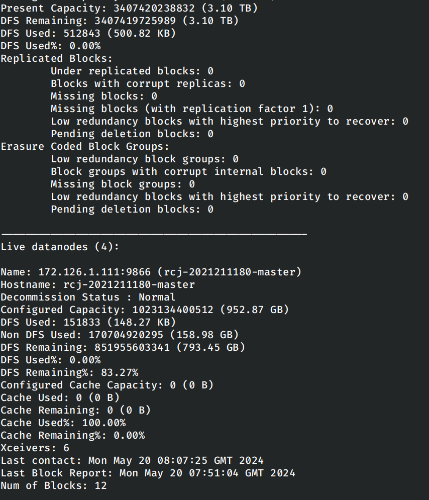
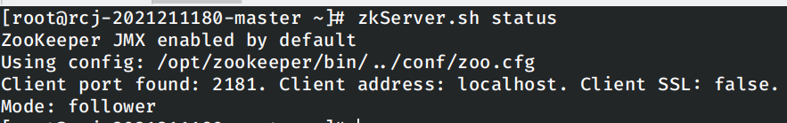
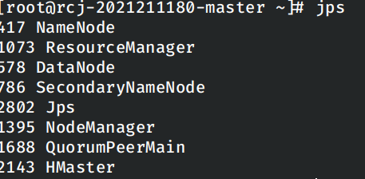
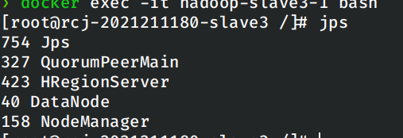
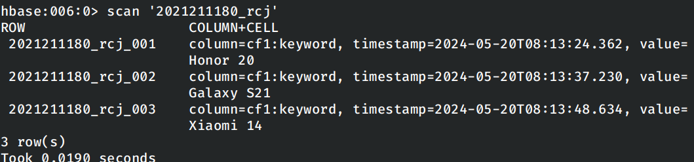
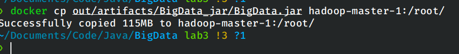
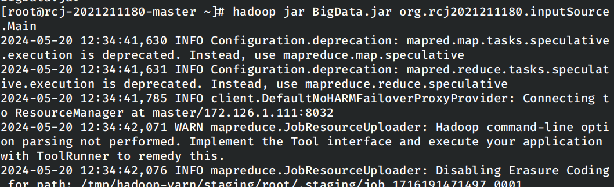
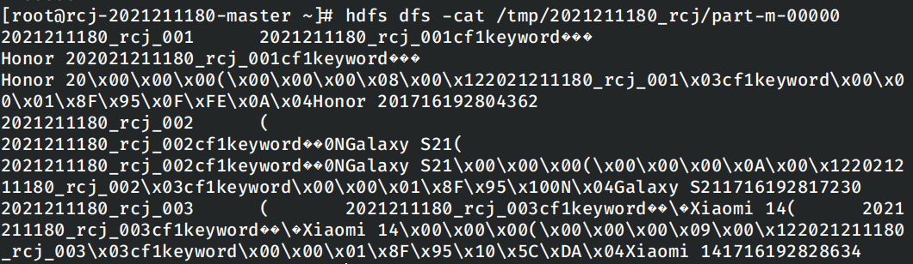
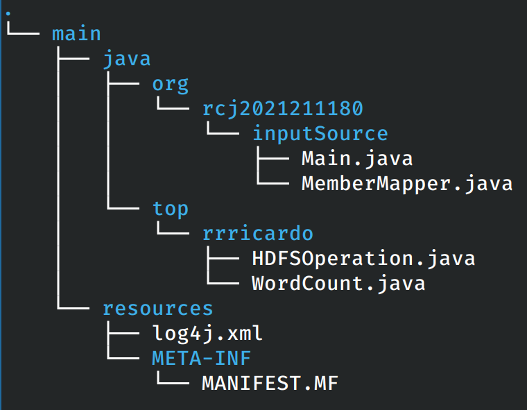
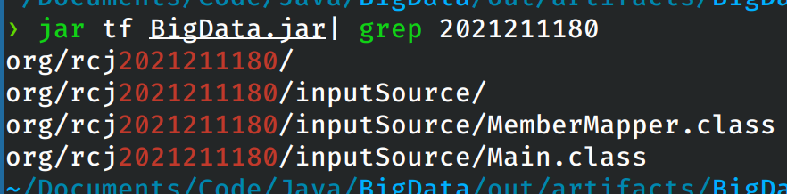

# 大数据技术基础实验三

## 实验目的

掌握`HBase`和`zookeeper`的安装和使用，使用`MapReduce`批量将`HBase`表中的数据导入到`HDFS`中。在实验中将快速掌握到`HBase`数据库在分布式计算中的应用，理解Java API读取`HBase`数据等的相关内容。

## 实验过程

### Docker配置

由于本次实验中，实验指导书推荐使用`docker`的方式进行`hbase`的配置，因此在之前实验的基础上，结合实验指导书对之前配置`docker`的`Dockerbuild`文件和`docker-compose.yml`文件进行了修改，以支持`hbase`和`zookeeper`。

现在将调整之后的文件贴到此处。

```dockerfile
FROM archlinux:latest

# Install necessary dependencies
RUN echo 'Server = https://mirrors.tuna.tsinghua.edu.cn/archlinux/$repo/os/$arch' > /etc/pacman.d/mirrorlist
RUN echo 'Server = https://mirrors.ustc.edu.cn/archlinux/$repo/os/$arch' >> /etc/pacman.d/mirrorlist
RUN echo 'Server = https://mirrors.aliyun.com/archlinux/$repo/os/$arch' >> /etc/pacman.d/mirrorlist
RUN pacman -Sy --noconfirm openssh jdk8-openjdk which inetutils

# Setting JAVA_HOME env
ENV JAVA_HOME=/usr/lib/jvm/java-8-openjdk

# Configuring SSH login
RUN echo 'ssh-rsa AAAAB3NzaC1yc2EAAAADAQABAAABgQCyyLt1bsAlCcadB2krSCDr0JP8SrF7EsUM+Qiv3m+V10gIBoCBFEh9iwpVN1UMioK8qdl9lm+LK22RW+IU6RjW+zyPB7ui3LlG0bk5H4g9v7uXH/+/ANfiJI2/2+Q4gOQAsRR+7kOpGemeKnFGJMgxnndSCpgYI4Is9ydAFzcQcGgxVB2mTGT6siufJb77tWKxrVzGn60ktdRxfwqct+2Nt88GTGw7eGJfMQADX1fVt9490M3G3x2Kw9KweXr2m+qr1yCRAlt3WyNHoNOXVhrF41/YgwGe0sGJd+kXBAdM2nh2xa0ZZPUGFkAp4MIWBDbycleRCeLUpCHFB0bt2D82BhF9luCeTXtpLyDym1+PS+OLZ3NDcvztBaH8trsgH+RkUc2Bojo1J4W9NoiEWsHGlaziWgF6L3z1vgesDPboxd0ol6EhKVX+QjxA9XE79IT4GidHxDwqonJz/dHXwjilqqmI4TEHndVWhJN0GV47a63+YCK02VAZ2mOA3aw/7LE= ricardo@magicbook-14' >> /root/.ssh/authorized_keys
COPY id_big_data /root/.ssh/id_rsa
RUN echo 'Host *' >> /etc/ssh/ssh_config && echo '    StrictHostKeyChecking no' >> /etc/ssh/ssh_config

# Install Hadoop
ADD hadoop-3.3.6.tar.gz /opt/
RUN mv /opt/hadoop-3.3.6 /opt/hadoop && \
    chmod -R 777 /opt/hadoop

# Configure Hadoop
ENV HADOOP_HOME=/opt/hadoop
RUN echo "slave1" >> $HADOOP_HOME/etc/hadoop/workers
RUN echo "slave2" >> $HADOOP_HOME/etc/hadoop/workers
RUN echo "slave3" >> $HADOOP_HOME/etc/hadoop/workers
RUN mkdir $HADOOP_HOME/tmp
ENV HADOOP_TMP_DIR=$HADOOP_HOME/tmp
RUN mkdir $HADOOP_HOME/namenode
RUN mkdir $HADOOP_HOME/datanode
ENV HADOOP_CONFIG_HOME=$HADOOP_HOME/etc/hadoop
ENV PATH=$JAVA_HOME/bin:$HADOOP_HOME/bin:$HADOOP_HOME/sbin:$PATH
ENV HADOOP_CLASSPATH=$HADOOP_HOME/share/hadoop/tools/lib/*:$HADOOP_HOME/share/hadoop/common/lib/*:$HADOOP_HOME/share/hadoop/common/*:$HADOOP_HOME/share/hadoop/hdfs/*:$HADOOP_HOME/share/hadoop/hdfs/lib/*:$HADOOP_HOME/share/hadoop/yarn/*:$HADOOP_HOME/share/hadoop/yarn/lib/*:$HADOOP_HOME/share/hadoop/mapreduce/*:$HADOOP_HOME/share/hadoop/mapreduce/lib/*:$HADOOP_CLASSPATH
ENV HDFS_NAMENODE_USER="root"
ENV HDFS_DATANODE_USER="root"
ENV HDFS_SECONDARYNAMENODE_USER="root"
ENV YARN_RESOURCEMANAGER_USER="root"
ENV YARN_NODEMANAGER_USER="root"
COPY hadoop_config/* $HADOOP_HOME/etc/hadoop/
RUN sed -i '1i export JAVA_HOME=/usr/lib/jvm/java-8-openjdk' $HADOOP_HOME/etc/hadoop/hadoop-env.sh

# Install zookeeper
ADD apache-zookeeper-3.9.2-bin.tar.gz /opt/
RUN mv /opt/apache-zookeeper-3.9.2-bin /opt/zookeeper && \
    chmod -R 777 /opt/zookeeper

# Configure zookeeper
ENV ZOOKEEPER_HOME=/opt/zookeeper
ENV PATH=$ZOOKEEPER_HOME/bin:$PATH
RUN mkdir $ZOOKEEPER_HOME/tmp
COPY zookeeper_config/* $ZOOKEEPER_HOME/conf/

# Install hbase
ADD hbase-2.5.8-bin.tar.gz /opt/
RUN mv /opt/hbase-2.5.8 /opt/hbase && \
    chmod -R 777 /opt/hbase

# Configure hbase
ENV HBASE_HOME=/opt/hbase
ENV PATH=$HBASE_HOME/bin:$HBASE_HOME/sbin:$PATH
COPY hbase_config/* $HBASE_HOME/conf/
RUN echo "export JAVA_HOME=/usr/lib/jvm/java-8-openjdk" >> $HBASE_HOME/conf/hbase-env.sh
RUN echo "export HBASE_MANAGES_ZK=false" >> $HBASE_HOME/conf/hbase-env.sh
RUN echo "export HBASE_LIBRARY_PATH=/opt/hadoop/lib/native" >> $HBASE_HOME/conf/hbase-env.sh
RUN echo 'export HBASE_DISABLE_HADOOP_CLASSPATH_LOOKUP="true"' >> $HBASE_HOME/conf/hbase-env.sh


COPY run.sh /run.sh
ENTRYPOINT [ "/run.sh" ]
```

启动的`docker-compose`文件如下：

```yaml
version: '3.8'
services:
  master:
    hostname: rcj-2021211180-master
    image: registry.cn-beijing.aliyuncs.com/jackfiled/hadoop-cluster
    command:
      - "1"
    networks:
      hadoop-network:
        ipv4_address: 172.126.1.111

  slave1:
    hostname: rcj-2021211180-slave1
    image: registry.cn-beijing.aliyuncs.com/jackfiled/hadoop-cluster
    command:
      - "2"
    networks:
      hadoop-network:
        ipv4_address: 172.126.1.112

  slave2:
    hostname: rcj-2021211180-slave2
    image: registry.cn-beijing.aliyuncs.com/jackfiled/hadoop-cluster
    command:
      - "3"
    networks:
      hadoop-network:
        ipv4_address: 172.126.1.113

  slave3:
    hostname: rcj-2021211180-slave3
    image: registry.cn-beijing.aliyuncs.com/jackfiled/hadoop-cluster
    command:
      - "4"
    networks:
      hadoop-network:
        ipv4_address: 172.126.1.114

networks:
  hadoop-network:
    driver: bridge
    ipam:
      config:
        - subnet: 172.126.1.0/24

```

通过上述的修改，基本上做到了一键启动，不必在启动之后做任何调整。

### 启动容器

首先执行

```shell
docker compose up -d
```

启动实验中所需要用到的全部4个容器。

然后进行`master`容器中，启动`hdfs`。这里启动的过程不再赘述，直接使用

```shell
hdfs dfsadmin -report
```

验证启动是否正确。



通过汇报的信息确认各个节点都能正常启动。

下面在各个节点上使用`zkServer.sh start`启动`zookeeper`。然后使用`zkServer.sh status`验证启动，这里我的`master`节点上的`zookeeper`被选举为`follower`。



最后启动`hbase`，然后使用`jps`验证各个容器中的Java进程个数。

首先是`master`节点：



然后是一个从节点：




### HBase实践

首先使用`hbase shell`进入交互式Shell，执行如下的指令插入示例数据：

```sql
create '2021211180_rcj', 'cf1'
put '2021211180_rcj', '2021211180_rcj_001', 'cf1:keyword', 'Honor 20'
put '2021211180_rcj', '2021211180_rcj_002', 'cf1:keyword', 'Galaxy S21'
put '2021211180_rcj', '2021211180_rcj_003', 'cf1:keyword', 'Xiaomi 14'
```

查看表中此时的内容：



### 编写程序读取HBase

按照实验指导书上的代码编写代码。

首先是`MemberMapper`类。这个类完成的工作类似于我们在实验二中使用`MapReduce`时编写的`Mapper`类，不过操作的数据从`HDFS`中的文件变成了`HBase`数据库中的数据。在下面这段代码中，我们将读取表中的每一行，并将其中的数据拼接为一个字符串输出到文件系统中。

```java
package org.rcj2021211180.inputSource;

import org.apache.hadoop.hbase.Cell;
import org.apache.hadoop.hbase.client.Result;
import org.apache.hadoop.hbase.io.ImmutableBytesWritable;
import org.apache.hadoop.hbase.mapreduce.TableMapper;
import org.apache.hadoop.hbase.util.Bytes;
import org.apache.hadoop.io.Text;
import org.apache.hadoop.io.Writable;

import java.io.IOException;

public class MemberMapper extends TableMapper<Writable, Writable> {
    public static final String FieldCommonSeparator = "\u0001";

    @Override
    protected void setup(Context context) throws IOException, InterruptedException {

    }

    @Override
    protected void map(ImmutableBytesWritable row, Result columns, Context context) throws IOException, InterruptedException {
        String key = new String(row.get());
        Text keyValue = new Text(key);

        try {
            for (Cell cell : columns.listCells()) {
                String value = Bytes.toStringBinary(cell.getValueArray());
                String columnFamily = Bytes.toString(cell.getFamilyArray());
                String columnQualifier = Bytes.toString(cell.getQualifierArray());

                long timestamp = cell.getTimestamp();

                Text valueValue = new Text(columnFamily + FieldCommonSeparator +
                        columnQualifier + FieldCommonSeparator +
                        value + FieldCommonSeparator + timestamp);

                context.write(keyValue, valueValue);
            }
        } catch (Exception e) {
            e.printStackTrace();
            System.err.println("Error: " + e.getMessage());
        }
    }
}
```

然后是程序中的主类`Main`。在主类中我们设置并启动了`MapReduce`的`Job`，这个工作将从我们指定的表中读取数据，并按照上一个`Mapper`类中的逻辑进行处理之后输出到文件系统中。

```java
package org.rcj2021211180.inputSource;

import org.apache.hadoop.conf.Configuration;
import org.apache.hadoop.fs.FileSystem;
import org.apache.hadoop.fs.Path;
import org.apache.hadoop.hbase.HBaseConfiguration;
import org.apache.hadoop.hbase.client.Scan;
import org.apache.hadoop.hbase.mapreduce.TableMapReduceUtil;
import org.apache.hadoop.hbase.util.Bytes;
import org.apache.hadoop.io.Text;
import org.apache.hadoop.mapreduce.Job;
import org.apache.hadoop.mapreduce.lib.output.FileOutputFormat;
import org.apache.hadoop.mapreduce.lib.output.TextOutputFormat;

import java.io.IOException;

public class Main {
    private static final String tableName = "2021211180_rcj";

    public static void main(String[] args) throws IOException, InterruptedException, ClassNotFoundException {
        Configuration config = HBaseConfiguration.create();

        // 设置扫描器对象
        Scan scan = new Scan();
        scan.setBatch(0);
        scan.setCaching(1000);
        scan.setMaxVersions();
        // 设置扫描的时间范围
        scan.setTimeRange(System.currentTimeMillis() - 3 * 24 * 2600 * 1000L, System.currentTimeMillis());
        // 设置需要扫描的列族
        scan.addColumn(Bytes.toBytes("cf1"), Bytes.toBytes("keyword"));

        config.setBoolean("mapred.map.tasks.speculative.execution", false);
        config.setBoolean("mapred.reduce.tasks.speculative.execution", false);

        Path tmpIndexPath = new Path("hdfs://master:8020/tmp/" + tableName);
        FileSystem fs = FileSystem.get(config);
        if (fs.exists(tmpIndexPath)) {
            fs.delete(tmpIndexPath, true);
        }

        Job job = new Job(config, "MemberTest1");
        job.setJarByClass(Main.class);

        TableMapReduceUtil.initTableMapperJob(tableName, scan, MemberMapper.class, Text.class, Text.class, job);
        job.setNumReduceTasks(0);
        job.setOutputFormatClass(TextOutputFormat.class);
        FileOutputFormat.setOutputPath(job, tmpIndexPath);

        boolean success = job.waitForCompletion(true);
        System.exit(success ? 0 : 1);
    }
}
```


### 在Docker中运行程序

在IDEA中将代码编译到`jar`包中，使用`docker cp`将编译好的`jar`包复制到容器内：



在`master`节点上运行任务：



等待任务完成之后，使用`hdfs`工具查看运行结果：



## 项目源代码

### 源代码目录的结构



在源代码目录中多余的是实验一和实验二的源代码。

### 包中的内容



