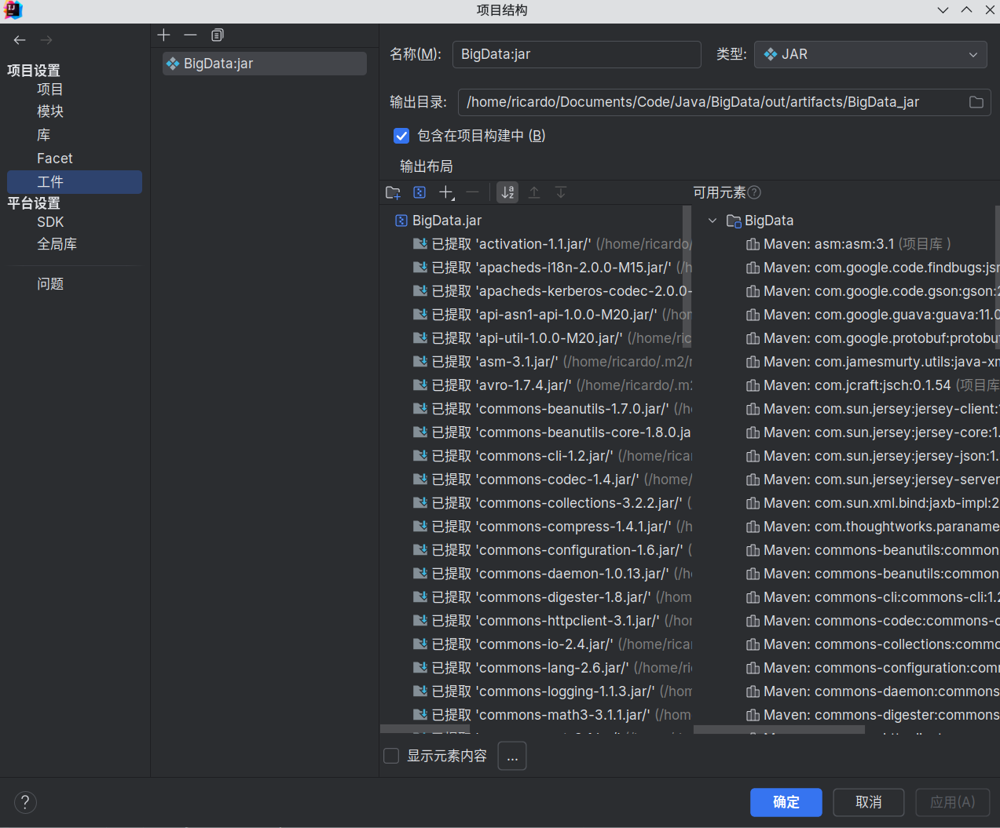

# 大数据实验二实验报告

<center><div style='height:2mm;'></div><div style="font-family:华文楷体;font-size:14pt;">任昌骏 2021211180</div></center>

## 实验描述

在实验中使用`IDEA`构建大数据工程，通过Java编写程序并通过集群运行，完成单词计数的任务。首先，在本地上完成`WordCount`工程的创建和程序的编写；然后将程序打包之后上传到之前搭建的`hadoop`集群中运行。

## 实验目的

1. 了解如何使用`IDEA`构建大数据工程
2. 熟悉使用Java语言编写大数据程序
3. 了解`MapReduce`的工程原理
4. 掌握如何在集群上运行`hadoop`程序

## 实验环境

`Hadoop`环境为使用`Docker`搭建的`Hadoop 2.7.7`环境，基础系统镜像为`archlinux`。使用`hdfs dfsadmin -report`确保集群运行正确。


使用的`JDK`版本为`1.8.0_412`，`IDEA`版本为2024.1.1。

## 实验步骤

### 创建工程并编写代码

在`IDEA`中创建`Maven`工程，添加相关的依赖并创建`log4j.xml`配置文件。创建本次实验中的主类`WordCount`，并编写对应的逻辑代码。

```java
package top.rrricardo;

import org.apache.hadoop.conf.Configuration;
import org.apache.hadoop.fs.Path;
import org.apache.hadoop.io.IntWritable;
import org.apache.hadoop.io.Text;
import org.apache.hadoop.mapreduce.Job;
import org.apache.hadoop.mapreduce.Mapper;
import org.apache.hadoop.mapreduce.Reducer;
import org.apache.hadoop.mapreduce.lib.input.FileInputFormat;
import org.apache.hadoop.mapreduce.lib.output.FileOutputFormat;
import org.apache.hadoop.util.GenericOptionsParser;

import java.io.IOException;
import java.util.StringTokenizer;

public class WordCount {
    public static class TokenizerMapper extends Mapper<Object, Text, Text, IntWritable> {
        private final static IntWritable one = new IntWritable(1);
        private final Text word = new Text();

        public void map(Object key, Text value, Context context) throws IOException, InterruptedException {
            StringTokenizer tokenizer = new StringTokenizer(value.toString());

            while (tokenizer.hasMoreTokens()) {
                word.set(tokenizer.nextToken());
                context.write(word, one);
            }
        }
    }

    public static class IntSumReducer extends Reducer<Text, IntWritable, Text, IntWritable> {
        private final IntWritable result = new IntWritable();

        public void reduce(Text key, Iterable<IntWritable> values, Context context) throws IOException, InterruptedException {
            int sum = 0;
            for (IntWritable value : values) {
                sum += value.get();
            }

            result.set(sum);
            context.write(key, result);
        }
    }

    public static void main(String[] args) throws IOException, InterruptedException, ClassNotFoundException {
        Configuration configuration = new Configuration();
        String[] otherArgs = new GenericOptionsParser(configuration, args).getRemainingArgs();
        if (otherArgs.length != 2) {
            System.err.println("Usage: WordCount <in> <out>");
            System.exit(-1);
        }

        Job job = new Job(configuration, "Word Counter");
        job.setJarByClass(WordCount.class);
        job.setMapperClass(TokenizerMapper.class);
        job.setReducerClass(IntSumReducer.class);
        job.setOutputKeyClass(Text.class);
        job.setOutputValueClass(IntWritable.class);
        FileInputFormat.addInputPath(job, new Path(otherArgs[0]));
        FileOutputFormat.setOutputPath(job, new Path(otherArgs[1]));
        System.exit(job.waitForCompletion(true) ? 0 : -1);
    }
}

```

上述的代码实际上由三个类构成，即`WordCount`主类和它的两个内部类`TokenizeMapper`和`IntSumReducer`。单词技术的主要逻辑就位于两个内部类中，这两个内部类分别集成了`Mapper`和`Reducer`，这对应着`MapReduce`框架中的两个核心工程，将任务分成若干个小任务，再将这一系列小任务的执行结果合并为最终结果。在这里，`Map`即为将字符串中的各个单词识别出来并将该单词的技术，而`Reducer`则负责收集这些结果，最终得到整个文本中的单词技术。主类这里负责解析用户的输出并启动对应的工作。

### 打包并上传到集群中

首先在`IDEA`中按照实验指导书中的步骤添加新的工件`Artifacts`：



然后运行打包指令打包成实际的`JAR`包。


使用`docker cp`将打包好的`JAR`包上传到集群中。


同时在上传一个文本文档作为下一步执行单词计数任务的输入，这里直接使用我们工程的源代码文件`WordCount.java`。


### 执行单词计数的任务

进入集群的主节点中，因为`MapReduce`的输入和输出文件都需要在`hdfs`文件系统中，因此首先使用指令将输入的文本文件上传到`hdfs`文件系统中。

首先创建一个`lab2`的文件夹作为区分：


然后将我们输入的文本文件上传到该文件夹下：


运行单词技术的程序，其中任务的输入文件为`/lab2/WordCount.java`，任务的输出文件夹为`/lab2/output/`。


使用命令检查任务运行的结果：


说明任务运行的非常成功。


