# 实验四实验报告

## 实验目的

- 了解服务器配置的过程
- 熟悉使用`Scala`编写`Spark`程序的过程
- 了解`Spark RDD`的工作原理
- 掌握在`Spark`集群上运行程序的方法
- 掌握使用`Spark SQL`读取数据库的方法

## 实验步骤

### 安装Spark

仍然直接使用`docker`的方式进行安装，直接将安装的步骤写在`Dockerfile`中，因此这里首先给出修改之后的`Dockerfile`：

```dockerfile
FROM archlinux:latest

# Install necessary dependencies
RUN echo 'Server = https://mirrors.tuna.tsinghua.edu.cn/archlinux/$repo/os/$arch' > /etc/pacman.d/mirrorlist
RUN echo 'Server = https://mirrors.ustc.edu.cn/archlinux/$repo/os/$arch' >> /etc/pacman.d/mirrorlist
RUN echo 'Server = https://mirrors.aliyun.com/archlinux/$repo/os/$arch' >> /etc/pacman.d/mirrorlist
RUN pacman -Sy --noconfirm openssh jdk8-openjdk which inetutils

# Setting JAVA_HOME env
ENV JAVA_HOME=/usr/lib/jvm/java-8-openjdk

# Configuring SSH login
RUN echo 'ssh-rsa AAAAB3NzaC1yc2EAAAADAQABAAABgQCyyLt1bsAlCcadB2krSCDr0JP8SrF7EsUM+Qiv3m+V10gIBoCBFEh9iwpVN1UMioK8qdl9lm+LK22RW+IU6RjW+zyPB7ui3LlG0bk5H4g9v7uXH/+/ANfiJI2/2+Q4gOQAsRR+7kOpGemeKnFGJMgxnndSCpgYI4Is9ydAFzcQcGgxVB2mTGT6siufJb77tWKxrVzGn60ktdRxfwqct+2Nt88GTGw7eGJfMQADX1fVt9490M3G3x2Kw9KweXr2m+qr1yCRAlt3WyNHoNOXVhrF41/YgwGe0sGJd+kXBAdM2nh2xa0ZZPUGFkAp4MIWBDbycleRCeLUpCHFB0bt2D82BhF9luCeTXtpLyDym1+PS+OLZ3NDcvztBaH8trsgH+RkUc2Bojo1J4W9NoiEWsHGlaziWgF6L3z1vgesDPboxd0ol6EhKVX+QjxA9XE79IT4GidHxDwqonJz/dHXwjilqqmI4TEHndVWhJN0GV47a63+YCK02VAZ2mOA3aw/7LE= ricardo@magicbook-14' >> /root/.ssh/authorized_keys
COPY id_big_data /root/.ssh/id_rsa
RUN echo 'Host *' >> /etc/ssh/ssh_config && echo '    StrictHostKeyChecking no' >> /etc/ssh/ssh_config

# Install Hadoop
ADD hadoop-3.3.6.tar.gz /opt/
RUN mv /opt/hadoop-3.3.6 /opt/hadoop && \
    chmod -R 777 /opt/hadoop

# Configure Hadoop
ENV HADOOP_HOME=/opt/hadoop
RUN echo "slave1" >> $HADOOP_HOME/etc/hadoop/workers
RUN echo "slave2" >> $HADOOP_HOME/etc/hadoop/workers
RUN echo "slave3" >> $HADOOP_HOME/etc/hadoop/workers
RUN mkdir $HADOOP_HOME/tmp
ENV HADOOP_TMP_DIR=$HADOOP_HOME/tmp
RUN mkdir $HADOOP_HOME/namenode
RUN mkdir $HADOOP_HOME/datanode
ENV HADOOP_CONFIG_HOME=$HADOOP_HOME/etc/hadoop
ENV PATH=$JAVA_HOME/bin:$HADOOP_HOME/bin:$HADOOP_HOME/sbin:$PATH
ENV HADOOP_CLASSPATH=$HADOOP_HOME/share/hadoop/tools/lib/*:$HADOOP_HOME/share/hadoop/common/lib/*:$HADOOP_HOME/share/hadoop/common/*:$HADOOP_HOME/share/hadoop/hdfs/*:$HADOOP_HOME/share/hadoop/hdfs/lib/*:$HADOOP_HOME/share/hadoop/yarn/*:$HADOOP_HOME/share/hadoop/yarn/lib/*:$HADOOP_HOME/share/hadoop/mapreduce/*:$HADOOP_HOME/share/hadoop/mapreduce/lib/*:$HADOOP_CLASSPATH
ENV HDFS_NAMENODE_USER="root"
ENV HDFS_DATANODE_USER="root"
ENV HDFS_SECONDARYNAMENODE_USER="root"
ENV YARN_RESOURCEMANAGER_USER="root"
ENV YARN_NODEMANAGER_USER="root"
COPY hadoop_config/* $HADOOP_HOME/etc/hadoop/
RUN sed -i '1i export JAVA_HOME=/usr/lib/jvm/java-8-openjdk' $HADOOP_HOME/etc/hadoop/hadoop-env.sh

# Install zookeeper
ADD apache-zookeeper-3.9.2-bin.tar.gz /opt/
RUN mv /opt/apache-zookeeper-3.9.2-bin /opt/zookeeper && \
    chmod -R 777 /opt/zookeeper

# Configure zookeeper
ENV ZOOKEEPER_HOME=/opt/zookeeper
ENV PATH=$ZOOKEEPER_HOME/bin:$PATH
RUN mkdir $ZOOKEEPER_HOME/tmp
COPY zookeeper_config/* $ZOOKEEPER_HOME/conf/

# Install hbase
ADD hbase-2.5.8-bin.tar.gz /opt/
RUN mv /opt/hbase-2.5.8 /opt/hbase && \
    chmod -R 777 /opt/hbase

# Configure hbase
ENV HBASE_HOME=/opt/hbase
ENV PATH=$HBASE_HOME/bin:$HBASE_HOME/sbin:$PATH
COPY hbase_config/* $HBASE_HOME/conf/
RUN echo "export JAVA_HOME=/usr/lib/jvm/java-8-openjdk" >> $HBASE_HOME/conf/hbase-env.sh
RUN echo "export HBASE_MANAGES_ZK=false" >> $HBASE_HOME/conf/hbase-env.sh
RUN echo "export HBASE_LIBRARY_PATH=/opt/hadoop/lib/native" >> $HBASE_HOME/conf/hbase-env.sh
RUN echo 'export HBASE_DISABLE_HADOOP_CLASSPATH_LOOKUP="true"' >> $HBASE_HOME/conf/hbase-env.sh

# Install spark
ADD spark-3.5.1-bin-hadoop3-scala2.13.tgz /opt/
RUN mv /opt/spark-3.5.1-bin-hadoop3-scala2.13 /opt/spark && \
    chmod -R 777 /opt/spark

# Configure spark
ENV SPARK_HOME=/opt/spark
ENV PATH=$SPARK_HOME/bin:$PATH
ENV HADOOP_CONF_DIR=/opt/hadoop/etc/hadoop
ENV YARN_CONF_DIR=/opt/hadoop/etc/hadoop
RUN mv /opt/spark/conf/spark-env.sh.template /opt/spark/conf/spark-env.sh && \
    echo 'export SPARK_DIST_CLASSPATH=$(/opt/hadoop/bin/hadoop classpath)' >> /opt/spark/conf/spark-env.sh && \
    touch /opt/spark/conf/workers && \
    echo "master" >> /opt/spark/conf/workers && \
    echo "slave1" >> /opt/spark/conf/workers && \
    echo "slave2" >> /opt/spark/conf/workers && \
    echo "slave3" >> /opt/spark/conf/workers

COPY run.sh /run.sh
```

正常启动容器，按照实验一中给定的步骤首先启动`hadoop`集群，首先验证`hadoop`集群启动是否成功。

```shell
yarn node -list
```

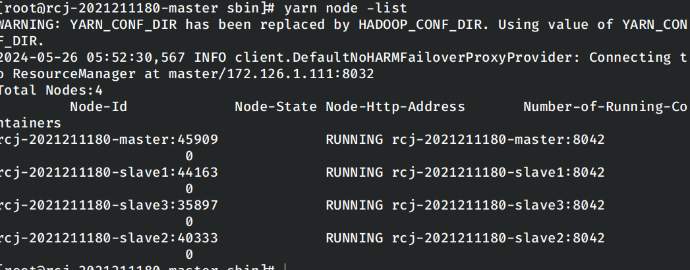

```shell
hdfs dfs -ls /
```

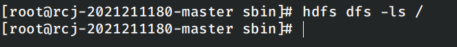

然后启动`spark`集群，确认集群启动成功。

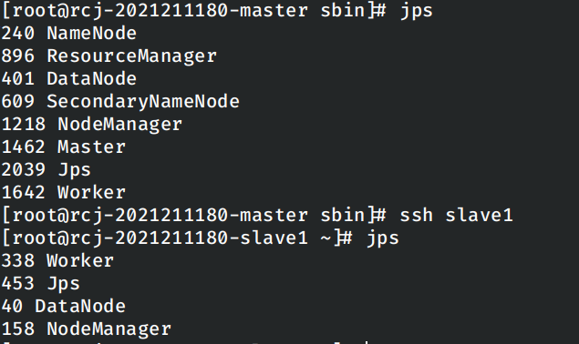

然后`spark-shell`验证`spark`是否正确可用。

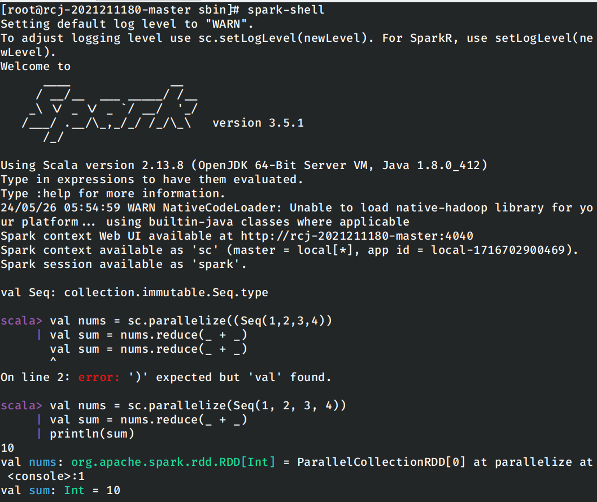

能够正常在交互式Shell下运行示例程序，说明`spark`的安装和启动正确。

### 编写程序完成单词计数任务

按照实验指导书中的说明创建使用`Spark`的`Scala`项目，在项目中编写进行单词计数的程序。在按照实验指导书上的指导，将编写好的程序编译打包为`jar`。

编写的程序如下：

```scala
package top.rcj2021211180
import org.apache.spark.{SparkConf, SparkContext}

class ScalaWordCount {

}

object ScalaWordCount {
  def main(args : Array[String]): Unit = {
    val list = List("hello hi hi spark",
      "hello spark hello hi sparksal",
      "hello hi hi sparkstreaming",
      "hello hi sparkgraphx")

    val sparkConf = new SparkConf().setAppName("word-count").setMaster("yarn")
    val sc = new SparkContext(sparkConf)
    val lines = sc.parallelize(list)
    val words = lines.flatMap((line: String) => {
      line.split(" ")
    })
    val wordOne = words.map((word: String) => {
      (word, 1)
    })
    val wordAndNum = wordOne.reduceByKey((count1: Int, count2: Int) => {
      count1 + count2
    })
    val ret = wordAndNum.sortBy(kv => kv._2, false)
    print(ret.collect().mkString(","))
    ret.saveAsTextFile(path = "hdfs://master:8020/spark-test")
    sc.stop()
  }
}
```

使用下述命令进行运行：

```shell
spark-submit --class top.rcj2021211180.ScalaWordCount --master yarn --num-executors 3 --driver-memory 1g --executor-memory 1g --executor-cores 1 BigData.jar
```

查看运行的结果：

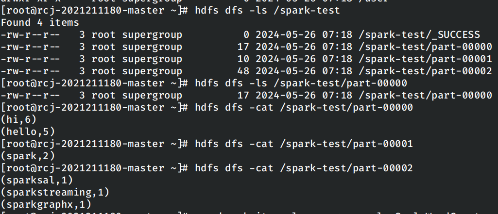

### 使用RDD编写独立应用程序实现数据去重

按照实验指导书中的内容编写下面的内容：

```scala
package top.rcj2021211180

import org.apache.spark.{SparkConf, SparkContext}

class ScalaDuplicateRemove {

}

object ScalaDuplicateRemove {
  def main(args: Array[String]): Unit = {
    val sparkConf = new SparkConf().setAppName("Scala Duplicate Remove").setMaster("local")
    val sc = new SparkContext(sparkConf)

    val basePath = "/duplicateFiles/"
    val linesA = sc.textFile(basePath + "A.txt")
    val linesB = sc.textFile(basePath + "B.txt")

    val lines = linesA.union(linesB).distinct().sortBy(identity)
    lines.saveAsTextFile(basePath + "C.txt")

    sc.stop()
  }
}
```

仍然按照上一次打包运行的方式进行打包和上传到集群中进行运行。

使用实验指导书中给出的样例的进行测试，首先将给定的两个文件`A.txt`和`B.txt`上传到`HDFS`文件系统中。

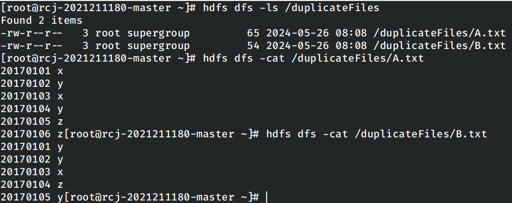

运行Spark程序：

```shell
spark-submit --class top.rcj2021211180.ScalaDuplicateRemove --master yarn --num-executors 3 --driver-memory 1g --executor-memory 1g --executor-cores 1 BigData.jar
```

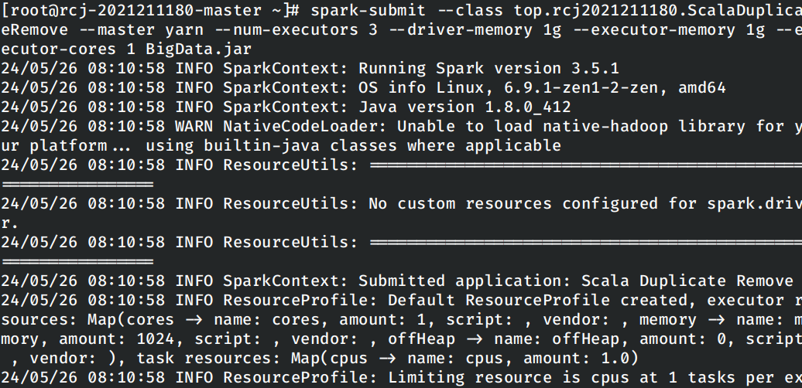

查看运行的结果：

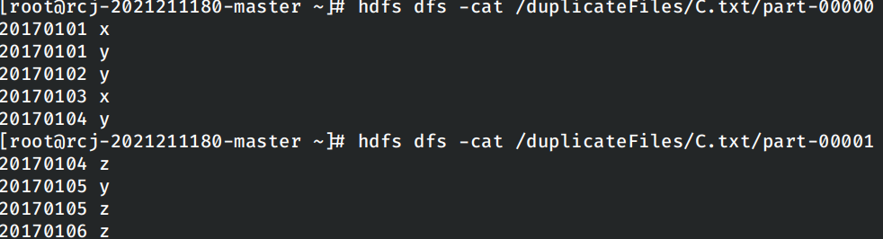

### 使用Spark SQL读写数据库

为了让`spark`可以访问`Mysql`数据库，需要在`spark`中添加`Mysql`的`JDBC Connector`，因此直接在`Dockerfile`中添加相关的`jar`包。

```dockerfile
# Add Mysql JDBC Connector
COPY mysql-connector-j-8.4.0.jar /opt/spark/jars/
```

这里使用容器的方式启动`mysql`，而不是直接在`master`容器中安装的方式。设计如下的`docker-compose.yml`文件：

```yaml
version: '3.8'
services:
  master:
    hostname: rcj-2021211180-master
    image: registry.cn-beijing.aliyuncs.com/jackfiled/hadoop-cluster
    command:
      - "/run.sh"
      - "1"
    networks:
      hadoop-network:
        ipv4_address: 172.126.1.111

  slave1:
    hostname: rcj-2021211180-slave1
    image: registry.cn-beijing.aliyuncs.com/jackfiled/hadoop-cluster
    command:
      - "/run.sh"
      - "2"
    networks:
      hadoop-network:
        ipv4_address: 172.126.1.112

  slave2:
    hostname: rcj-2021211180-slave2
    image: registry.cn-beijing.aliyuncs.com/jackfiled/hadoop-cluster
    command:
      - "/run.sh"
      - "3"
    networks:
      hadoop-network:
        ipv4_address: 172.126.1.113

  slave3:
    hostname: rcj-2021211180-slave3
    image: registry.cn-beijing.aliyuncs.com/jackfiled/hadoop-cluster
    command:
      - "/run.sh"
      - "4"
    networks:
      hadoop-network:
        ipv4_address: 172.126.1.114

  db:
    image: mysql:8.0-debian
    environment:
     MYSQL_ROOT_PASSWORD: 12345678
    networks:
      hadoop-network:

networks:
  hadoop-network:
    driver: bridge
    ipam:
      config:
        - subnet: 172.126.1.0/24

```

重新启动集群。

在重新启动集群并添加`mysql`容器之后，首先进入`mysql`容器中在修改数据库的相关设置和创建供`spark`读写的数据库，并建立示例表，在表中插入两条示例数据。

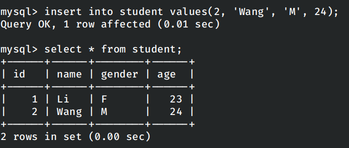

进入`Master`节点，重新启动`hadoop`集群并重新启动`spark`集群。

在进入`spark-shell`之后使用实验指导书上的命令验证`spark`是否能够访问数据库：

```scala
val jdbcDP = spark.read.format("jdbc").
     | option("url", "jdbc:mysql://db:3306/spark").
     | option("driver", "com.mysql.cj.jdbc.Driver").
     | option("dbtable", "student").
     | option("user", "root").
     | option("password", "12345678").
     | load()
```

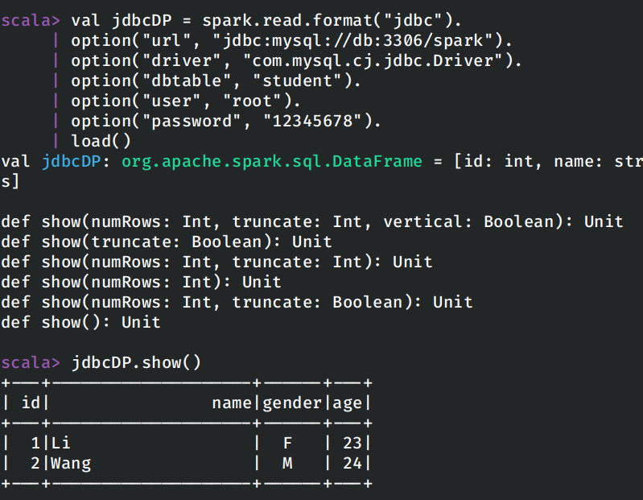

需要注明的是，这里在使用容器启动数据库之后，需要将`JDBC`链接字符串的地址从`localhost`变更为对应容器的域名`db`。

在使用`spark-shell`验证可以读数据库之后，编写`scala`代码在数据库中写入更多的数据。

```scala
package top.rcj2021211180

import org.apache.spark.sql.{Row, SparkSession}
import org.apache.spark.sql.types.{IntegerType, StringType, StructField, StructType}

import java.util.Properties

class InsertStudent {

}

object InsertStudent {
  def main(args : Array[String]): Unit = {
    val spark = SparkSession.builder()
      .appName("Insert Student")
      .master("local")
      .getOrCreate()

    val sc = spark.sparkContext

    val studentData = Array("3 Zhang M 26", "4 Liu M 27")
    val studentRDD = sc.parallelize(studentData).map(_.split("\\s+"))

    val scheme = StructType(List(
      StructField("id", IntegerType, true),
      StructField("name", StringType, true),
      StructField("gender", StringType, true),
      StructField("age", IntegerType, true)
    ))

    val rowRDD = studentRDD.map(attr => Row(attr(0).toInt, attr(1), attr(2), attr(3).toInt))

    val studentDF = spark.createDataFrame(rowRDD, scheme)

    val jdbcUrl = "jdbc:mysql://db:3306/spark"
    val connectionProperties = new Properties()
    connectionProperties.put("user", "root")
    connectionProperties.put("password", "12345678")
    connectionProperties.put("driver", "com.mysql.cj.jdbc.Driver")

    studentDF.write
      .mode("append")
      .jdbc(jdbcUrl, "spark.student", connectionProperties)

    spark.stop()
  }
}
```

编写如上的程序，编译打包并上传到集群中运行。

```shell
spark-submit --class top.rcj2021211180.InsertStudent --master yarn --num-executors 3 --driver-memory 1g --executor-memory 1g --executor-cores 1 BigData.jar
```

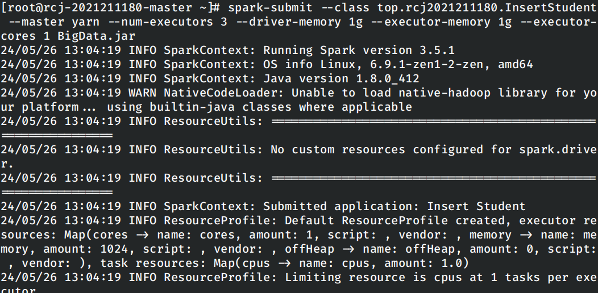

在运行之后，进入数据库容器中查看表中的内容：

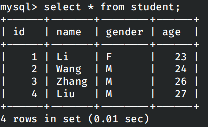

## Bug列表

### 无法在Master节点上启动Spark的Worker

在使用`bash start-workers.sh`脚本启动Spark的Workers时，我发现运行报错：

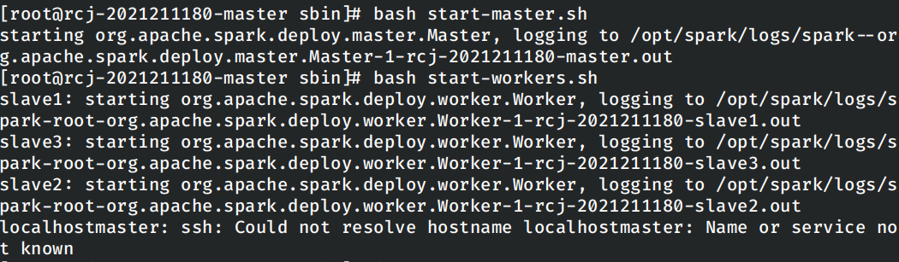

同时在`master`节点上运行`jps`发现，当前节点上并没有启动`worker`：

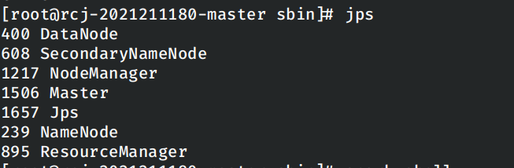

显然在脚本尝试在本地节点上启动Worker时报错失败了，但是此时的`Spark`集群中剩下的节点仍然正确启动了，使用`spark-shell`可以正常的计算。

经排查发现是`spark/conf/workers`中的内容错误：

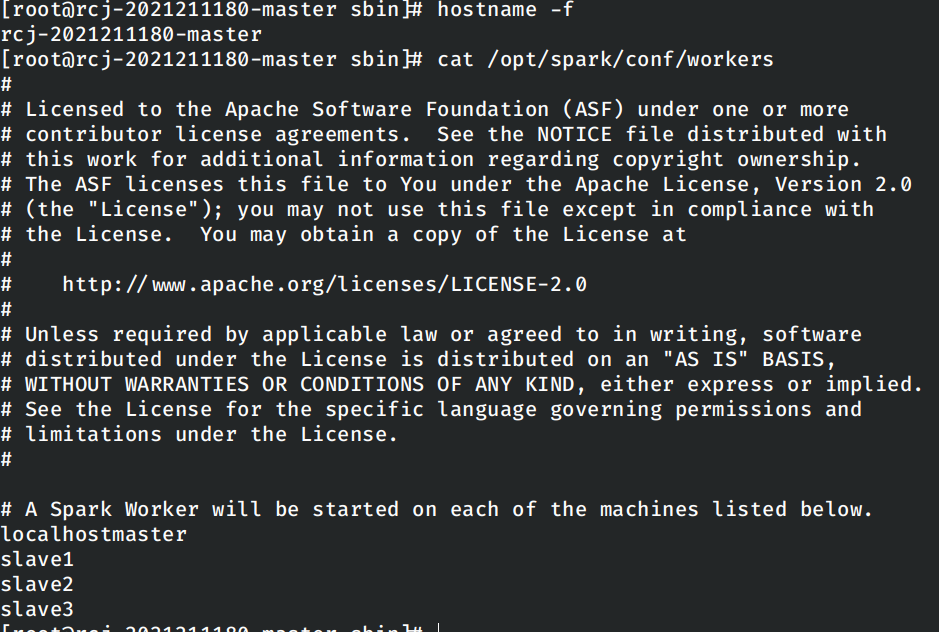

修改`Dockerfile`中设置相关内容的命令修复问题。

重新创建容器之后再次启动`spark`集群，问题解决。

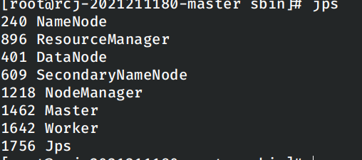

### Failed to load class报错

在将`jar`打包好上传到`spark`中进行运行时报错提示无法找到主类。

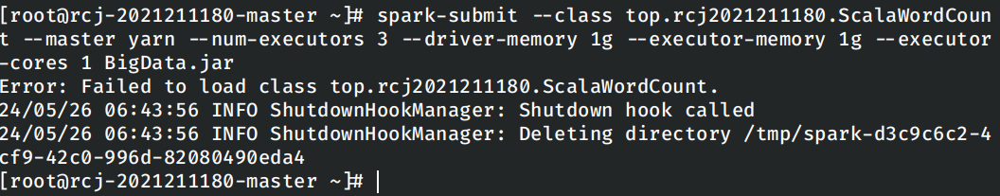

解压打包好的`jar`包，发现其中确实没有将`top.rcj2021211180.ScalaWordCount`这个`class`，怀疑在编译过程中出现配置错误。

尝试重新创建项目，并且在打包之前首先运行一次编译再打包，并在打包好之后按照实验指导书上的说明删除`MANIFEST.MF`文件，再次上传到集群中进行运行，此时程序没有报错。