# 金融行业羊毛党识别案例实践报告

## 实验目的

利用移动的梧桐大数据平台，基于机器学习算法进行数据挖掘从而预测“羊毛党”，从而了解分类任务并了解其原理。

## 实验过程

### 实验准备

登录梧桐鸿鹄大数据实操平台，在平台上创建实验中需要用到的工程项目。在创建时选择项目模板时选择通用模板，方便在实验中进行数据编排和数据挖掘。

### 数据流程编排

首先是创建数据处理的数据流。

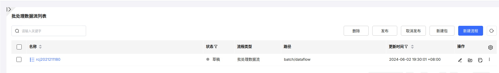

创建好数据流之后，在数据流画布中进行算子的编排。编排算子主要需要完成训练数据的提取和预测数据的提取两项工作。数据编排和大致上分成三个阶段：

1. 从`HDFS`文件系统上提取出需要使用的数据；
2. 将提取的数据进行处理，例如分组、过滤，并且划分为训练数据和预测数据两个部分。
3. 将训练数据和预测数据输出到`HDFS`文件系统中存储。

#### 第一阶段 数据提取

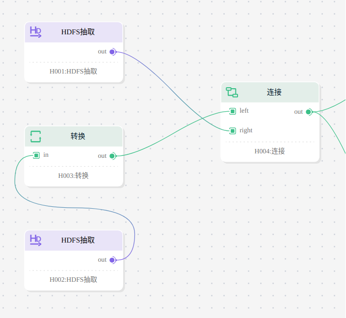

在这一阶段将从两个文件中分别读取用户的信息和用户的行为，并按照用户的电话号码聚合为一张表。聚合之后的表中输出列如下图所示：

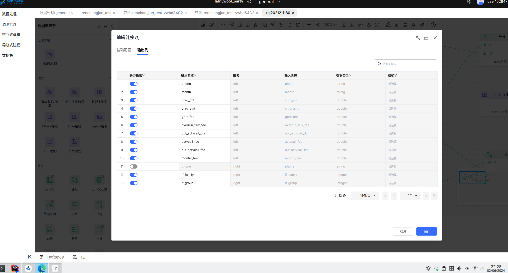

#### 第二阶段 数据分组和过滤

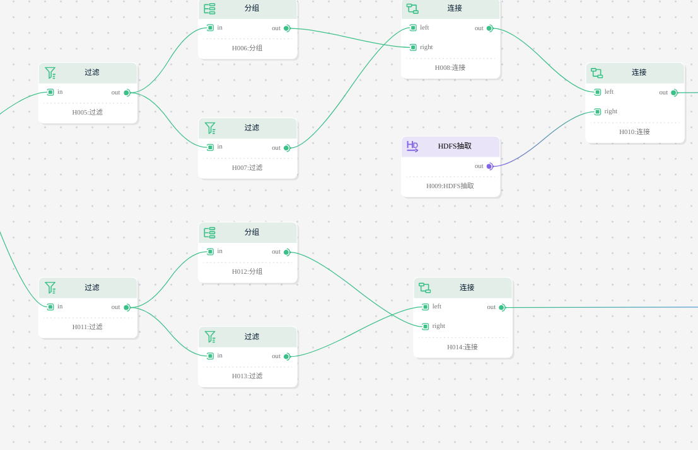

这一节点就会将数据分成训练数据和预测数据两个部分，其中训练数据来自于原始数据中2020年1月和2020年2月的部分，而预测数据则来自于原始数据中2020年3月和2020年4月的部分。在这一阶段，还将对数据按照电话号码进行聚合之后求`chrg_amt`字段的平均值和`chgr_cnt`字段的和并和该电话号码的其他字段合在一起输出。对于训练数据，还需要从文件系统中读取用户的标签。

在完成以上部分步骤之后，训练数据流中最后一个连接算子的输出列如下图所示：

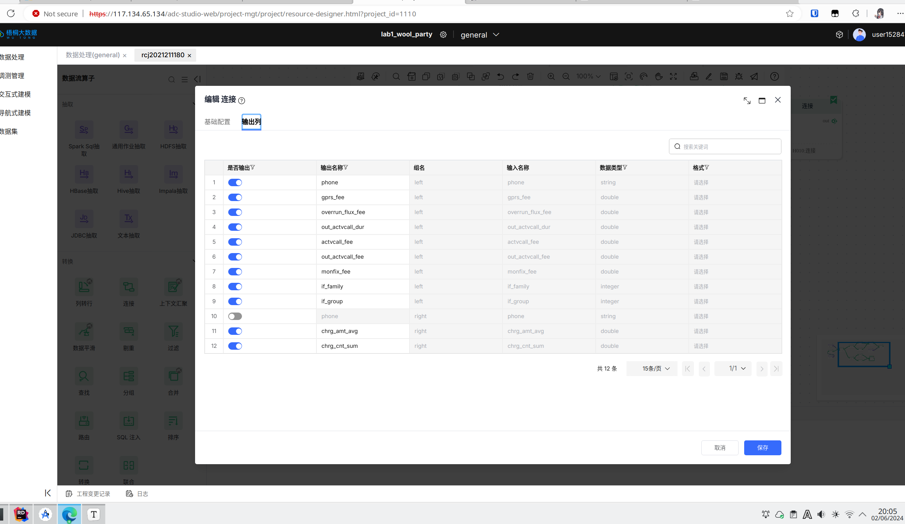

预测数据流的最后一个连接算子的输出列如下图所示：

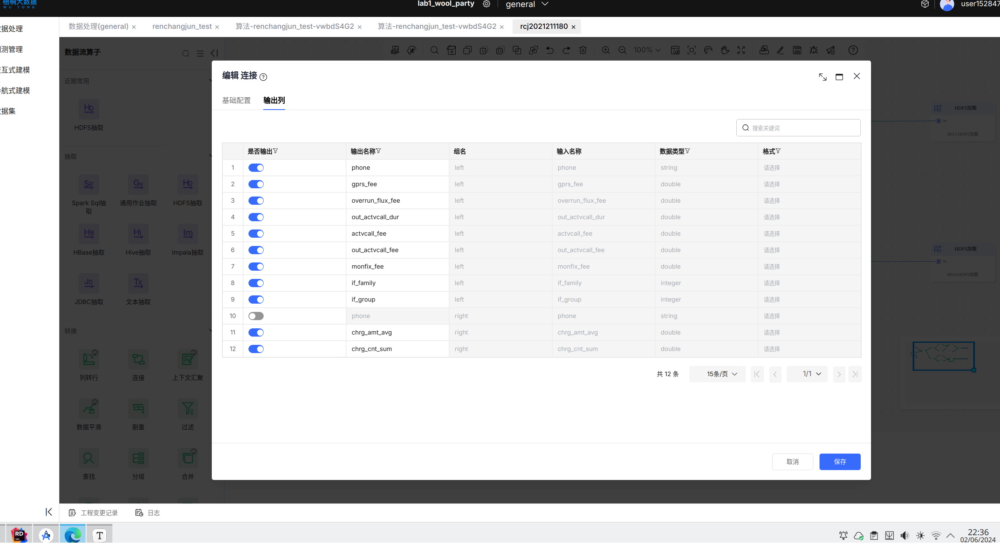

#### 数据保存

这一阶段将上述阶段中提取出的数据以`csv`文件的形式保存在`HDFS`文件系统中。

其中训练数据的保存路径为:

```
/srv/multi-tenant/midteant02/dev/user/p6_bupt/p6_bupt_102/etl_output/renchangjun_2021211180_train_data.csv
```

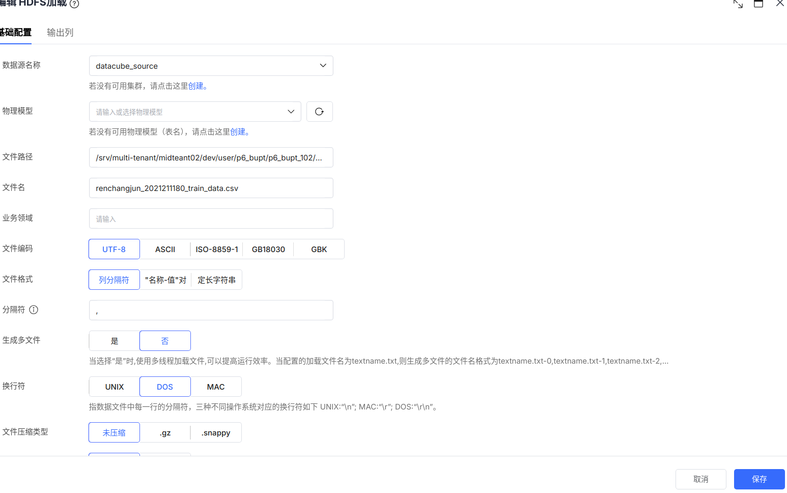

预测数据的保存路径为：

```
/srv/multi-tenant/midteant02/dev/user/p6_bupt/p6_bupt_102/etl_output/renchangjun_2021211180_predict_data.csv
```

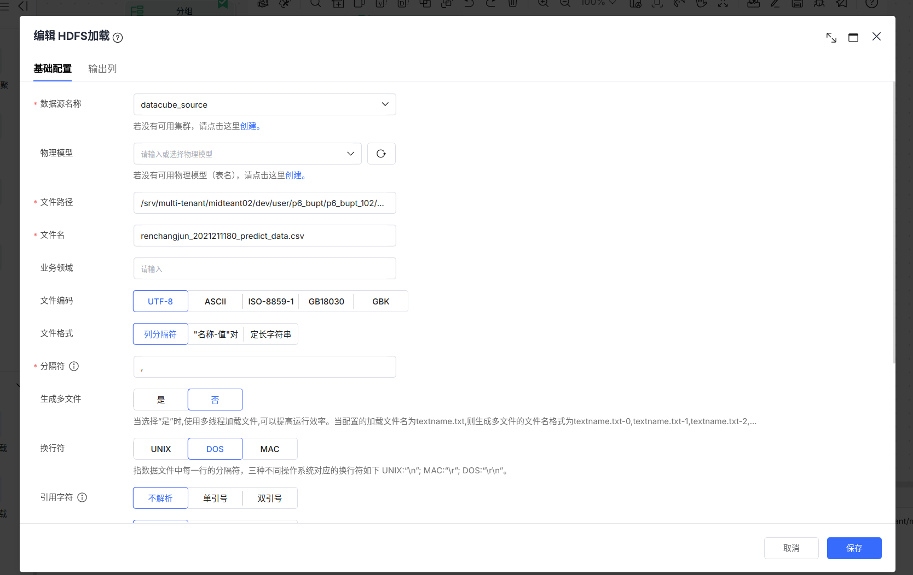

预测数据最后的输出列如下图所示：

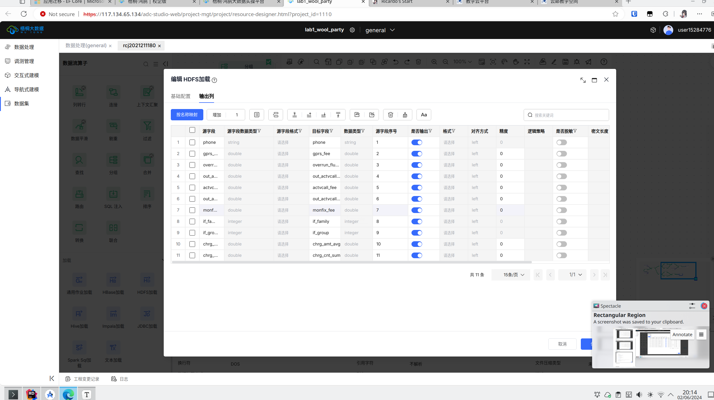

### 数据流的在线调测

在完成数据流的编排之后，进入数据流的在线调测界面。

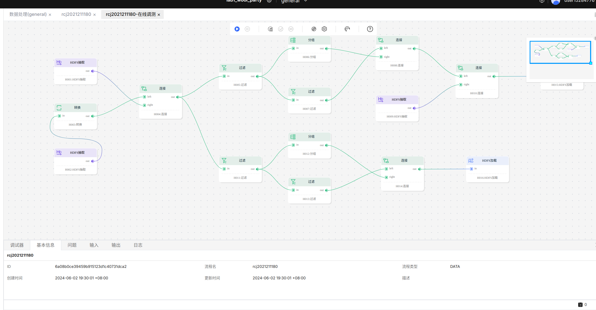

运行调测之后显示调测成功。

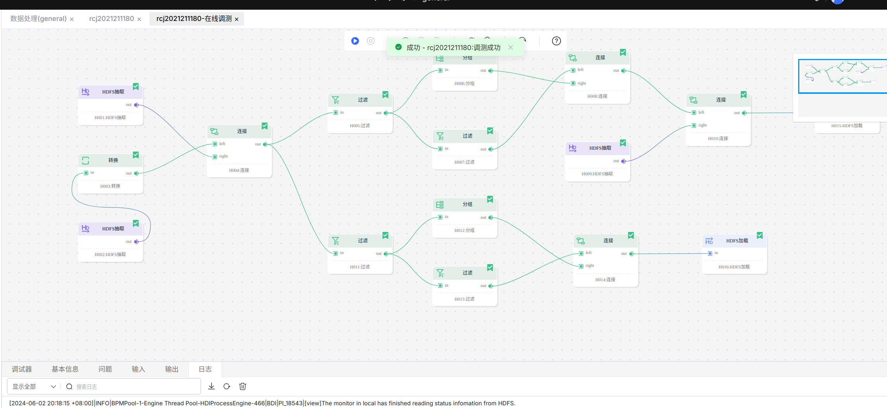

过程中的日志截图如下：

首先是启动各个组件：

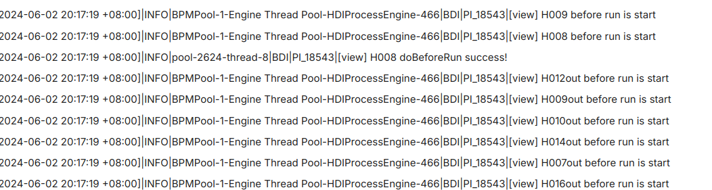

然后是提交`Spark`任务成功：

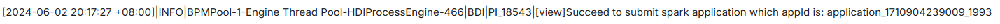

最后是数据流任务全部完成：


### 数据挖掘

首先建立数据需要使用的交互式建模模型，并在建立模型时选择`Pytorch-Tensorflow`引擎。

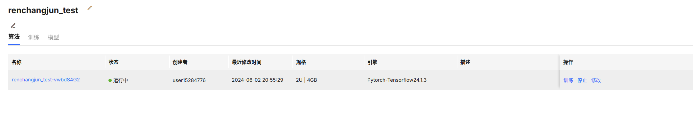

然后进行`jupyter`笔记本的编辑页面，按照实验指导书的说明编写代码训练一个从数据中可以识别出“羊毛党”的二分类模型。

```python
import pandas as pd #用于处理高级数据结构和数据分析
from manas.dataset import mfile #用于从 HDFS 上读取数据文件
from sklearn.metrics import roc_auc_score,classification_report #用于评估模型预测结果
from sklearn.model_selection import train_test_split #用于划分训练数据集和测试数据集
from xgboost import XGBClassifier #用于构建基于 XGBoost 算法的分类模型

train_path = "hdfs://cxq-ns1/srv/multi-tenant/midteant02/dev/user/p6_bupt/p6_bupt_102/etl_output/renchangjun_2021211180_train_data.csv" #训练数据集文件地址
file_r = mfile.mfile(train_path, "r") #获取文件操作
train_df = pd.read_csv(file_r, sep='\,', header=0) #使用 pandas 将数据读取成 DataFrame，完成后直接使用变量操作文件
file_r.close() #读取完成后关闭数据流
predict_path = "hdfs://cxq-ns1/srv/multi-tenant/midteant02/dev/user/p6_bupt/p6_bupt_102/etl_output/renchangjun_2021211180_predict_data.csv" #预测数据集文件地址
file_r = mfile.mfile(predict_path, "r") #获取文件操作
predict_df = pd.read_csv(file_r, sep='\,', header=0) #使用 pandas 将数据读取成 DataFrame，完成后直接使用变量操作文件
file_r.close() #读取完成后关闭数据流

train_df.fillna(0,inplace = True) #缺失值填充为 0
predict_df.fillna(0,inplace = True) #缺失值填充为 0
target_data = train_df[['phone','label']] #导出标签数据
del train_df['label'] #删除训练数据标签
train_data = train_df
train_data = train_data.set_index('phone') #将 phone 作为 DataFrame 索引
target_data = target_data.set_index('phone') #将 phone 作为 DataFrame 索引
predict_df = predict_df.set_index('phone') #将 phone 作为 DataFrame 索引

model = XGBClassifier(min_chile_weight = 1,max_depth = 10,learning_rate = 0.05,gamma = 0.4,colsample_bytree = 0.4) #构建 XGBoost 二分类模型
x_train,x_test,y_train,y_test = train_test_split(train_data,target_data,test_size = 0.3,random_state = 42) #随机划分训练数据集和测试数据集
model.fit(x_train,y_train) #训练模型
predict_l = model.predict_proba(x_test)[:,1] #输出预测结果
auc = roc_auc_score(y_test,predict_l) #计算 AUC
print('AUC is {}'.format(auc)) #输出 AUC

pd.DataFrame({'feature':x_train.columns,'importance':model.feature_importances_}).sort_values(ascending = False,by = 'importance') #降序输出模型特征重要度

#模型性能指标评估报告函数
def get_threshold_report(y_predict, target_name):
    model_count = y_predict[target_name].value_counts().sort_index()[1] #获得测试数据集中"羊毛党"的用户数量
    y_test = y_predict[[target_name]] #单独取出标签列
    model_test = y_predict.copy()
    report = pd.DataFrame() #初始化 report 为 DataFrame 格式
    for i in range(1, 20): #等间隔选取 0.05～0.95 的 20 个不同概率阈值
        sep_pr = [] #记录本次划分结果
        sep_value = i * 0.05 #本次阈值
        col_name = 'sep_.' + str(round(sep_value, 2)) #本次列名，用于记录预测标签
        model_test[col_name] = model_test['predict'].apply(lambda x: 1 if x > sep_value else 0) #根据预测概率及阈值生成预测标签
        sep_pr.append(str(round(sep_value, 2))) #记录本次阈值
        sep_pr.append(model_count) #记录真实"羊毛党"的用户数量
        predict_model = model_test[col_name].value_counts().sort_index() 
        #获取预测标签分类统计数量
        if predict_model.shape[0] == 1: #只有一类标签的情况
            if predict_model.index.format() == '0': #一类标签为 0，即不存在被预测为"羊毛党"的用户
                sep_pr.append(0) #记录被预测为"羊毛党"的用户数量为 0
            else:
                sep_pr.append(predict_model[0]) #一类标签为 1，即所有用户均被预测为"羊毛党"，记录被预测为"羊毛党"的用户数量，即 predict_model 的第一行数据
        else: #两类标签的情况
            sep_pr.append(predict_model[1]) #记录被预测为"羊毛党"的用户数量，即predict_model 的第二行数据
        model_report = classification_report(y_test, model_test[col_name].values, digits=4) #根据真实标签和预测标签生成分类报告
        pr_str = ' '.join(model_report.split('\n')[3].split()).split(' ') 
        #提取分类报告最后一行的三种评估指标
        sep_pr.append(pr_str[1]) #记录精确率
        sep_pr.append(pr_str[2]) #记录召回率
        sep_pr.append(pr_str[3]) #记录 F1 分数
        report = pd.concat([report, pd.DataFrame([sep_pr])], axis=0) #拼接本次划分的评估报告
    report.columns = ['threshold', 'actual', 'predict', 'precision', 'recall', 'f1-score'] #设置评估报告列名
    report = report.reset_index(drop=True) #重置索引，并将原索引删除
    return report #返回模型性能指标评估报告

y_test['predict'] = predict_l #添加预测结果列
get_threshold_report(y_test, 'label') #生成性能指标评估报告

#输出模型推理结果
output = predict_df.copy() #获取待预测数据
output['predict_proba'] = model.predict_proba(output)[:, 1] #使用模型进行预测，得到预测概率
output['predict_label'] = output['predict_proba'].apply(lambda x: 1 if x > 0.25 else 0) #根据选定的概率阈值划分"羊毛党"
df_output = output[['predict_proba', 'predict_label']].sort_values(ascending=False, by='predict_proba') #按照预测概率降序排列疑似"羊毛党"
df_output.to_csv('output.csv') #保存预测结果
df_output #输出预测结果
```

在笔记本中运行上述代码的截图如下：

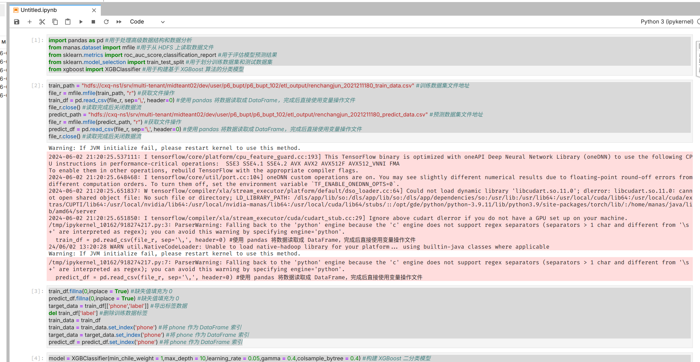

代码中训练得到的性能指标评估报告如下图所示：

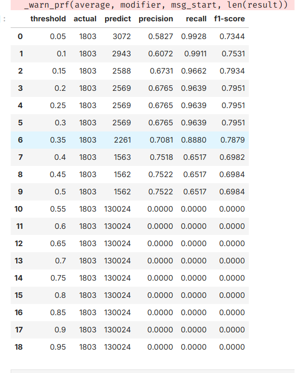

从报告中可以发现，在阈值取到0.2到0.3之前的时候，`f1`分数达到最高，大约在79.51%上下，因此在代码中进行预测时我选择的阈值为0.2。预测的结果如下图所示：

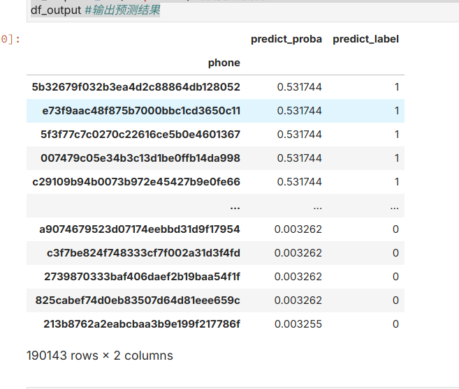

## 实验总结

在本次实验中，我通过中国移动开发的梧桐大数据实训平台实际体验了大数据技术在企业实际生产过程所发挥的重要作用，并为大数据技术在解决企业中实际问题所发挥的巨大作用而震撼。在实验中，我还体验到可视化进行数据的编排是一种对于初学者来说非常高效的使用手段，相较于与之间使用`Java`编写代码来访问`HDFS`来说大大提高了效率和程序的可读性。

### 实验中的bug

1. 在将分组和过滤好的数据保存在`HDFS`文件系统中时，没有选择自动导出表头，导致在后续数据挖掘的过程中无法获得到各个字段的名称。这个问题在微信群中快速得到指导老师的解答，很快就解决了。

   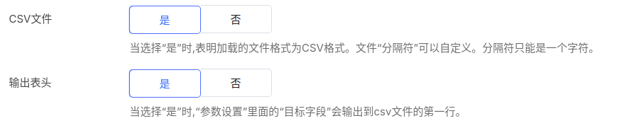

2. 在填写代码中的`HDFS`地址时没有保留下服务器的名称`cxq-ns1`导致无法在代码中访问到`HDFS`服务器。这个问题在报错信息的提示下也很快便解决了。

   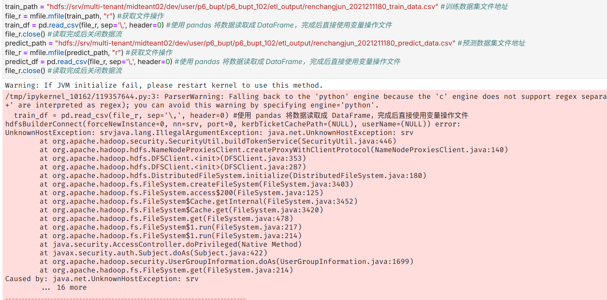